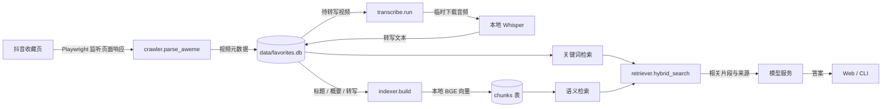
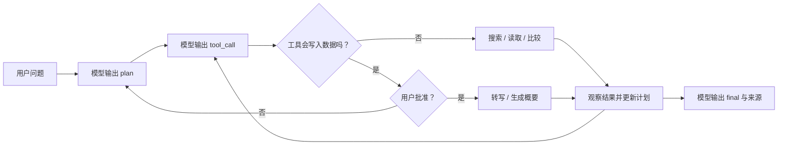

# 浮光 · 抖音收藏研究台

把自己的抖音收藏整理成可搜索、可转写、可提问的本地知识库。Playwright 采集收藏元数据，SQLite 保存内容；音频转写与句向量计算在本机完成。生成概要、自动分类和 AI 问答会把相关文本发送给你配置的模型服务。

> 项目依赖抖音页面结构和接口响应。页面变化后，采集或下载可能需要调整。请仅处理你有权访问的内容，并遵守平台规则。

## Web 界面

下图来自独立的空白示例数据库，不包含真实收藏、登录态或 API Key。

| Agent 研究 | 数据维护 |
| --- | --- |
|  |  |

页面还有「收藏库」和「模型设置」。登录并同步后，收藏库可以按关键词与类别查找视频；模型设置用于添加和测试兼容 OpenAI Chat Completions 的服务。

## 从零开始

需要 Python 3.10+。Windows 可双击 `start.bat`：它创建 `.venv`、安装依赖和 Chromium、下载本地 Whisper 与 BGE 模型，然后在 `http://127.0.0.1:8642` 启动页面。模型首次下载较大，需要联网。脚本还会在缺少 `.env` 时从 `.env.example` 创建一份，供 CLI 的概要和问答使用。

想逐步安装时，在项目根目录运行：

```powershell
python -m venv .venv
.\.venv\Scripts\Activate.ps1
python -m pip install -r requirements.txt
python -m playwright install chromium
python scripts/download_model.py small
python scripts/download_model.py bge
python main.py web
```

macOS/Linux 把激活命令换成 `source .venv/bin/activate`。如只需要采集与关键词搜索，可暂缓下载模型；转写需要 Whisper，本地语义检索需要 BGE。BGE 缺失时，问答检索会退回关键词路径。

打开页面后，按这个顺序操作：

1. 在「数据维护」点「扫码登录」，完成抖音登录，再点「同步收藏夹」。
2. 去「收藏库」搜索标题、标签、作者；需要检索视频里讲过的话时，先转写一批。
3. 在「模型设置」添加 API 地址、模型名和 API Key，测试连接后再使用概要、分类和 Agent 研究。
4. 在「Agent 研究」提问，查看计划、执行轨迹和引用来源。若 Agent 请求转写或概要，页面会等待你批准。

Web 的模型池保存在**当前浏览器的 localStorage**，发起任务时传给本地服务，再由服务调用所选模型提供方。CLI 的 `summarize` 和 `ask` 使用根目录 `.env` 中的 `LLM_API_KEY`、`LLM_BASE_URL`、`LLM_MODEL`；可从 `.env.example` 复制。不要把真实密钥提交到 Git。

## 一张图看数据怎么流动



**搜索**直接查 SQLite：短词走 `LIKE`，较长查询可走 FTS5。**提问**先查关键词和语义向量，用 RRF 合并排名，再把命中片段交给模型。音频下载发生在转写时，临时文件放在 `audio_cache/`。

Agent 研究多了一层决策循环：



运行状态和步骤快照写入 SQLite，页面刷新或服务重启后可以继续查看会话。后台任务在处理条目之间检查取消标志，因此取消可能等当前条目处理完才生效。

## 从哪些文件读起

| 文件 | 负责什么 | 先看哪个函数或对象 |
| --- | --- | --- |
| `main.py` | CLI 命令分发 | `main()` 解析参数；`cmd_ask()` 串起索引、检索和回答 |
| `app/web.py` | FastAPI 路由与后台任务 | `videos()` 返回收藏；`ask()` 执行普通问答；`agent_ask()` 启动研究；`_start_job()` 管理长任务 |
| `app/crawler.py` | 登录、监听收藏接口、解析视频 | `login()` 保存登录态；`parse_aweme()` 整理字段；`crawl()` 滚动采集 |
| `app/db.py` | SQLite 表、读写、FTS 搜索、会话持久化 | `init_db()` 建表；`save_favorites()` 增量入库；`search()` 查收藏；`get_conn()` 管理事务 |
| `app/transcribe.py` | 下载临时音频并本地转写 | `run()` 批量处理；`_download_audio()` 下载；`_transcribe_file()` 调 Whisper |
| `app/indexer.py`、`app/embedder.py` | 文本分块与向量化 | `chunk_text()` 切片；`build()` 增量建索引；`encode_docs()` 编码文本 |
| `app/retriever.py` | 语义与关键词混合召回 | `hybrid_search()` 合并排名；`build_contexts()` 组织模型输入 |
| `app/llm.py`、`app/llm_router.py` | CLI 模型调用与 Web 模型池 | `summarize()` / `answer()`；`parse_pool()` 校验配置；`LLMRouter.chat()` 选择服务 |
| `app/agent/tools.py` | Agent 可用工具及写入门槛 | `ToolRegistry.call()` 校验参数并检查 `allow_write` |
| `app/agent/runtime.py` | Agent 的计划、调用、结束循环 | `AgentExecution` 保存一次运行的计划、消息、步骤和状态 |
| `static/index.html`、`static/app.js`、`static/app.css` | 页面结构、交互、样式 | `fetchJson()` 发 API 请求；`state` 保存当前页面状态 |

### 读代码时会遇到的基础语法

下面的片段对应 `app/crawler.py` 中的解析思路：

```python
def parse_aweme(item: dict) -> dict | None:
    aweme_id = item.get("aweme_id")
    if not aweme_id:
        return None
    return {"aweme_id": aweme_id, "title": item.get("desc") or ""}
```

- `def` 定义函数；`item: dict` 是参数类型提示；`-> dict | None` 表示返回字典或 `None`。
- `item.get("aweme_id")` 在字段缺失时得到 `None`，避免直接取键导致异常。
- `if not aweme_id: return None` 提前跳过无 ID 的记录。
- `or ""` 给缺失标题一个空字符串，便于后续存库。
- 前端 `app.js` 中的 `async function` 与 `await` 用来等待网络请求，同时让页面保持响应。

另一个关键语法是 `with db.get_conn() as conn:`：`get_conn()` 是上下文管理器，正常结束会提交事务，出错会回滚，最后关闭连接。读懂它后，`db.py` 里的写入函数会容易很多。

## CLI 常用命令

```powershell
python main.py login                 # 打开浏览器扫码，保存登录态
python main.py crawl                 # 同步收藏元数据
python main.py stats                 # 查看数量
python main.py search "机器学习"      # 搜索标题、标签、作者与转写
python main.py transcribe 10         # 转写 10 条；--all 处理全部待转写条目
python main.py summarize 10          # 为已转写条目生成概要，需 .env
python main.py index                 # 增量构建本地语义索引
python main.py ask "这些视频如何解释 RAG？"  # 检索并调用模型回答，需 .env
python main.py web --port 8642       # 启动 Web 页面
```

`ask` 会尝试自动补建索引；手动运行 `index --all` 可全量重建。Web 的「数据维护」提供同步、转写、概要、分类和重建索引操作。分类由模型先根据收藏内容提出类别，再批量归类；结果存入数据库。

## 常见问题与选择

| 看到什么 | 先检查什么 | 为什么 |
| --- | --- | --- |
| 搜索结果少 | 是否只同步了元数据、尚未转写 | 标题能搜到的词有限，转写会扩大文本范围 |
| 问答找不到相关视频 | 是否已有转写或概要、BGE 模型是否下载 | 语义索引以已有内容为基础；缺 BGE 时只走关键词 |
| 提示重新登录 | 在页面重新扫码，再重试同步或转写 | 登录态和视频下载地址都可能过期 |
| 转写慢 | 先试少量；CLI 可用 `--model base` | 小模型通常更快，但识别质量可能变化 |
| 模型返回 401 | 检查 Web 模型设置或 CLI `.env` 的密钥 | Web 与 CLI 使用不同的配置入口 |

读完后，可以继续追问这些“为什么”：**为什么只监听浏览器已经发出的请求？为什么问答要合并关键词和语义结果？为什么 Agent 的转写操作要单独批准？** 这些问题分别对应采集稳定性、召回质量和数据修改边界，也适合用来决定下一步要优化哪一层。

## 本地文件与隐私

`data/` 存收藏、转写、概要、向量和会话；`browser_data/` 存抖音登录态；`models/` 存下载的模型；`audio_cache/` 存临时音频。它们都应留在本机。Web 模型配置保存在浏览器本地存储中，共享电脑用完可在「模型设置」清除；概要、分类、问答会向所选模型服务发送必要文本。分享项目时只分享源代码和 `.env.example`，不要打包这些本地目录或 `.env`。
