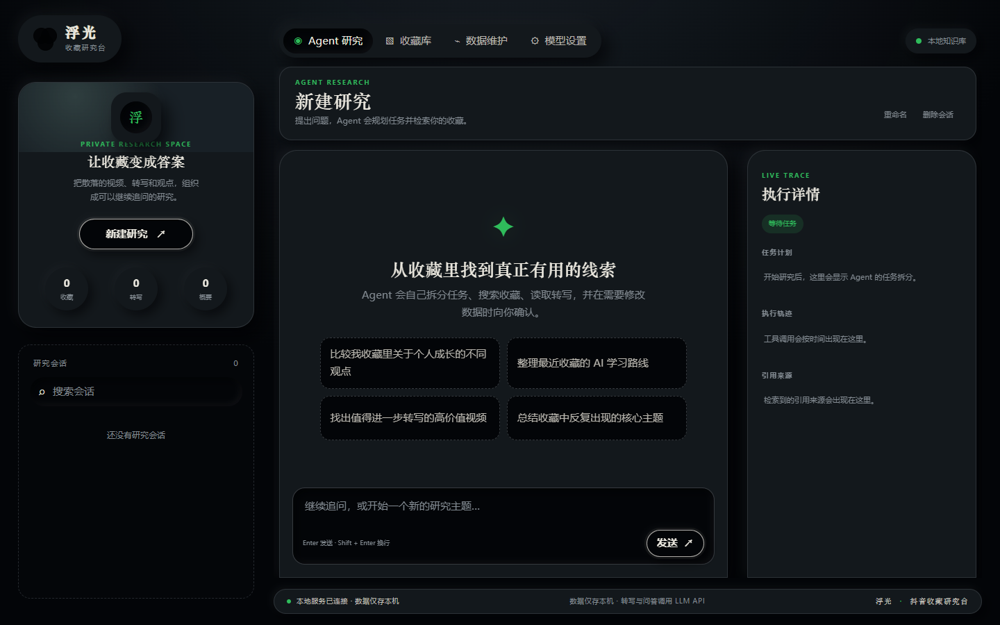
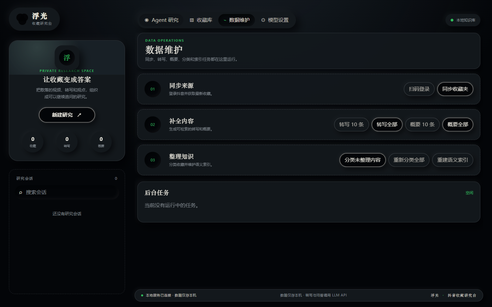
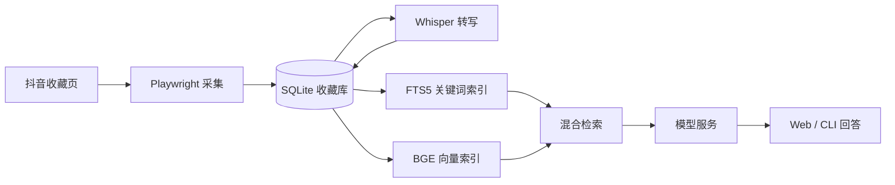

# 浮光 · 抖音收藏研究台

把抖音收藏整理成可搜索、可转写、可问答的个人知识库。应用在本地采集和保存收藏内容，使用本地模型完成语音转写与语义索引；概要、分类和问答通过用户配置的 OpenAI Chat Completions 兼容服务完成。

## 功能

- **收藏同步**：扫码登录后采集标题、作者、标签和链接，重复同步时按视频 ID 增量入库。
- **搜索与整理**：搜索标题、标签、作者和转写文本；按 AI 生成的类别筛选收藏。
- **本地转写**：需要时下载音频，使用 faster-whisper 转写，文本保存到 SQLite。
- **检索问答**：结合 FTS5 关键词检索与本地 BGE 语义检索，按相关片段生成带来源的回答。
- **Agent 研究**：拆分研究任务，逐步搜索、读取和比较收藏；转写、概要等写入操作需在页面批准。研究会话、执行记录和引用可恢复。
- **模型池**：在 Web 页面配置多个模型服务，按优先级和权重路由，请求失败时切换可用配置。

## Web 界面

截图使用空白示例数据库，不包含个人收藏、登录态或 API Key。

| Agent 研究 | 数据维护 |
| --- | --- |
|  |  |

界面另有「收藏库」和「模型设置」。

## 快速开始

需要 **Python 3.10+**。Windows 用户可直接运行 `start.bat`。脚本会创建虚拟环境、安装依赖和 Chromium、下载 Whisper 与 BGE 模型，然后启动 `http://127.0.0.1:8642`。模型首次下载需要联网。

手动安装：

```powershell
python -m venv .venv
.\.venv\Scripts\Activate.ps1
python -m pip install -r requirements.txt
python -m playwright install chromium
python scripts/download_model.py small
python scripts/download_model.py bge
python main.py web
```

macOS/Linux 使用 `source .venv/bin/activate` 激活虚拟环境。BGE 缺失时，问答会退回关键词检索；Whisper 模型用于本地转写。

首次使用时，在「数据维护」扫码登录并同步收藏。随后可在「收藏库」搜索和转写视频；需要概要、分类或 Agent 研究时，先到「模型设置」添加并测试模型服务。

## 模型配置

Web 模型配置保存在当前浏览器的 `localStorage`。发起任务时，配置随请求提交给本地服务，由本地服务调用所选模型提供方。共享设备使用完毕后，可在「模型设置」清除浏览器配置。

CLI 的 `summarize` 和 `ask` 使用项目根目录的 `.env`。复制 `.env.example`，填写 `LLM_API_KEY`、`LLM_BASE_URL` 和 `LLM_MODEL`。Web 模型设置与 CLI `.env` 是两个独立的配置入口。

## CLI

```text
python main.py login                  扫码登录
python main.py crawl                  同步收藏
python main.py search <关键词>         搜索收藏
python main.py transcribe [数量]       转写；--all 处理全部待转写视频
python main.py summarize [数量]        生成概要
python main.py index [--all]          增量构建或全量重建语义索引
python main.py ask <问题>              检索并回答
python main.py stats                  查看库内统计
python main.py web [--port 8642]      启动 Web 服务
```

## 技术架构



| 路径 | 职责 |
| --- | --- |
| `main.py` | CLI 入口 |
| `app/crawler.py`、`app/transcribe.py` | 收藏采集、音频下载和转写 |
| `app/db.py` | SQLite、FTS5、任务与会话持久化 |
| `app/indexer.py`、`app/embedder.py`、`app/retriever.py` | 文本分块、向量索引和混合检索 |
| `app/llm.py`、`app/llm_router.py` | CLI 模型调用与 Web 模型池 |
| `app/agent/` | Agent 工具和执行循环 |
| `app/web.py`、`static/` | FastAPI 服务和前端页面 |

## 数据与隐私

收藏、转写、概要、向量和研究会话保存在本机的 `data/`；`browser_data/` 保存登录态，`models/` 保存本地模型，`audio_cache/` 保存临时音频。这些目录及 `.env` 已加入 `.gitignore`。概要、分类和问答会向所选模型服务发送相关内容。

采集依赖抖音当前的页面结构和接口响应，平台调整后可能需要更新适配逻辑。请仅处理有权访问的内容，并遵守平台规则。
